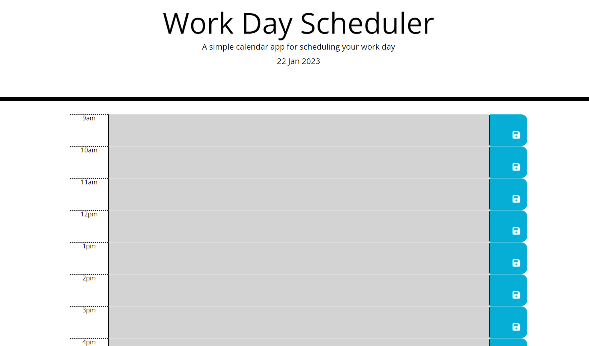

# Daily-Planner-App - Bootcamp Week 7

## Working with Web APIs: Code Quiz

This project uses JavaScript and JQuery to dynamically update a page in the browser. Moment.js is used to set the current date, and update the colours of different time blocks based on whether they are past, current or future times.

The app does the following:

- Displays the current day at the top of the calendar when a user opens the planner.

- Presents timeblocks for standard business hours when the user scrolls down.

- Color-codes each timeblock based on past, present, and future when the timeblock is viewed.

- Allows a user to enter an event when they click a timeblock.

- Saves the event in local storage when the save button is clicked in that timeblock.

- Persists events between refreshes of a page.

## Usage

Here is a mock up of the page:

 

## Credits

[Assignment] https://courses.bootcampspot.com/courses/3021/assignments/44745?module_item_id=832402

## Link to deployed application

https://sonia-deni.github.io/Daily-Planner-App/

## License

This project is licensed under the MIT License

## Badges

